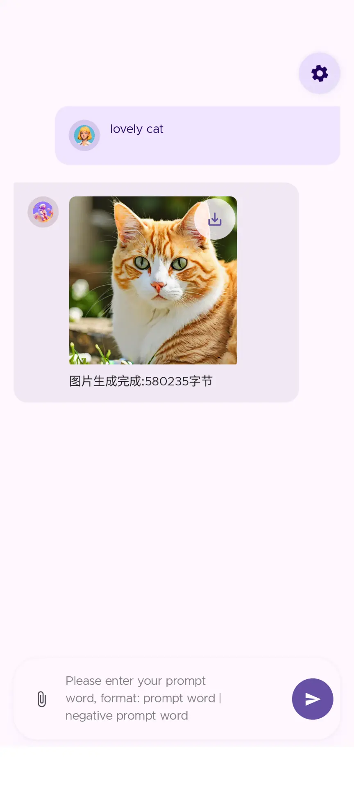
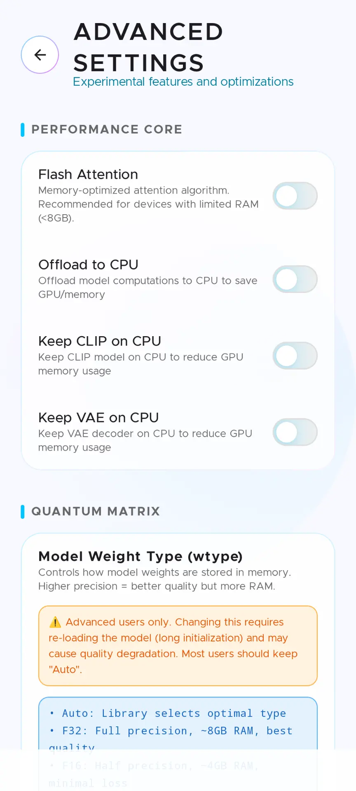
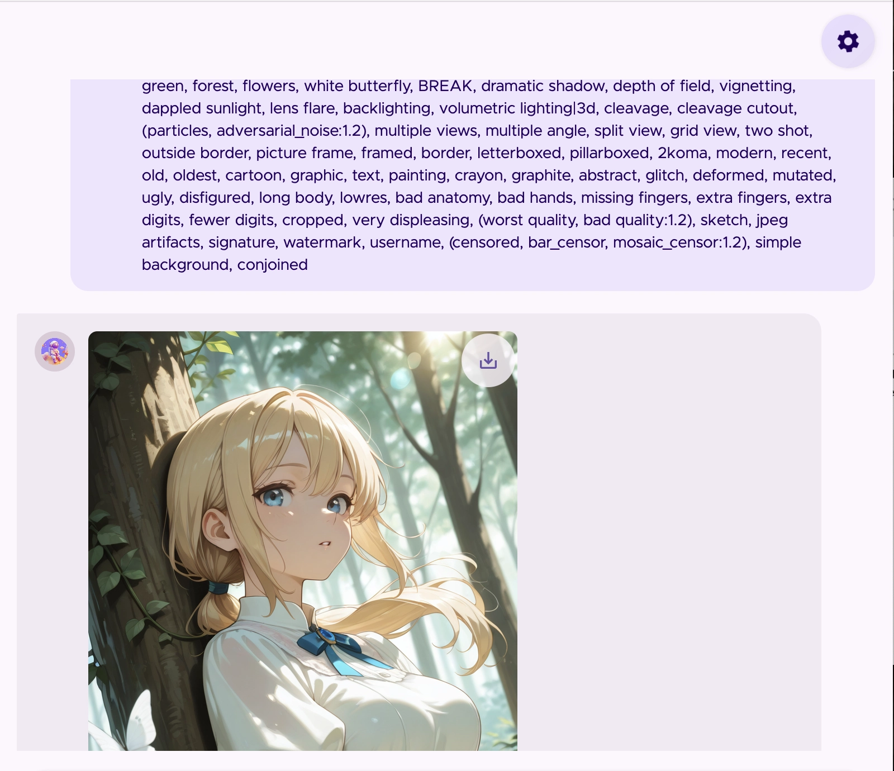
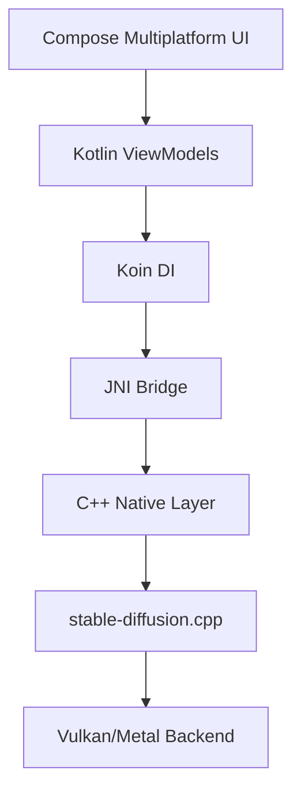

<div align="center">


# Mine StableDiffusion 🎨

**The kotlin multiplatform Stable Diffusion client**  
_Generate stunning AI art locally on Your devices_

<p align="center">
  <a href="https://kotlinlang.org"></a>
  <a href="#"></a>
  <a href="https://github.com/Onion99/KMP-MineStableDiffusion/releases">
    
  </a>
  <a href="https://github.com/Onion99/KMP-MineStableDiffusion/stargazers">
    
  </a>
</p>

<p align="center">
  
  
  
  
</p>


</div>

---

## ✨ What is Mine StableDiffusion?

Mine StableDiffusion is a **native, offline-first AI art generation app** that brings the power of Stable Diffusion models to your fingertips. Built with modern Kotlin Multiplatform technology and powered by the blazing-fast [stable-diffusion.cpp](https://github.com/leejet/stable-diffusion.cpp) engine, it delivers desktop-class performance on both Android and Desktop platforms.

### 🎯 Why Choose This App?

- **🚀 Native Performance** - C++ backend with JNI bindings for maximum speed
- **🔒 Privacy First** - 100% offline, all processing happens on your device
- **🎨 Modern UI** - Beautiful Compose Multiplatform interface
- **📱 True Multiplatform** - Shared codebase for Android & iOS & Desktop
- **🔧 Model Flexibility** - Support for FLUX, SDXL, SD3, and many more
- **⚡ Hardware Accelerated** - Vulkan 1.2+ (Android/Linux/Windows) & Metal (macOS)

---

## 📸 Screenshots

<div align="center">

|                                🤖 Android-1                                |                                                   Android-2                                                   |                                     Android-3                                      |
|:--------------------------------------------------------------------------:|:-------------------------------------------------------------------------------------------------------------:|:----------------------------------------------------------------------------------:|
|  |  |  | 


|                 💻 Desktop-1                  |                 💻 Desktop-2                  | Desktop-mac                             |
|:---------------------------------------------:|:---------------------------------------------:|-----------------------------------------|
|  |  |  | 

</div>

---

## 🎲 Supported Models & Performance Tiers

Mine StableDiffusion supports a wide range of models. To help you choose the best model for your device, we've organized them by performance requirements:

### � Entry & Speed (Fastest, Minimal VRAM)
_Ideal for older phones or integrated graphics. High speed, low memory usage._
- ✅ **[SD-Turbo](https://huggingface.co/stabilityai/sd-turbo)** - Extremely fast 1-step generation
- ✅ **[SD1.x / SD2.x](https://civitai.com/models)** - Classic Stable Diffusion models (Very efficient)
- ✅ **🎨 [Chroma](https://github.com/leejet/stable-diffusion.cpp/blob/master/docs/chroma.md) / [Chroma1-Radiance](https://github.com/leejet/stable-diffusion.cpp/blob/master/docs/chroma_radiance.md)** - Vibrant color generation

### ⚖️ Balanced Performance (Standard Quality)
_Good balance between quality and speed. Works well on most modern devices._
- ✅ **[SDXL-Turbo](https://huggingface.co/stabilityai/sdxl-turbo)** - Fast high-quality 512x512 to 1024x1024 images
- ✅ **🖼️ [Z-Image](https://github.com/leejet/stable-diffusion.cpp/blob/master/docs/z_image.md)** - Advanced image synthesis
- ✅ **🧠 [Qwen Image](https://github.com/leejet/stable-diffusion.cpp/blob/master/docs/qwen_image.md)** - Alibaba's multimodal model

### 💎 Professional Quality (High Requirements)
_Best for high-detail 1024x1024+ generation. Requires more VRAM and time._
- ✅ **[SDXL](https://huggingface.co/stabilityai/sdxl-turbo)** - Standard high-quality base model
- ✅ **[SD3 / SD3.5](https://github.com/leejet/stable-diffusion.cpp/blob/master/docs/sd3.md)** - Stability AI's latest high-fidelity architecture
- ✅ **👁️ [Ovis-Image](https://github.com/leejet/stable-diffusion.cpp/blob/master/docs/ovis_image.md)** - Vision-language model

### 🌌 Next-Gen Large Models (Flagship & High-End PC)
_State-of-the-art models with massive parameter counts. Best for flagship phones or dedicated GPUs._
- ✅ **[FLUX.1-schnell / dev](https://github.com/leejet/stable-diffusion.cpp/blob/master/docs/flux.md)** - Next-gen image quality
- ✅ **[FLUX.2-dev](https://github.com/leejet/stable-diffusion.cpp/blob/master/docs/flux.md)** - Latest and most capable iteration

> [!TIP]
> For model-specific documentation, check the [docs](./docs) folder

---

## 🌟 Key Features

### Text-to-Image Generation
Generate stunning images from text descriptions with various models

```
Input: "A serene mountain landscape at sunset, digital art"
Output: High-quality AI-generated image
```

### Custom Model Support
- Load your own fine-tuned models
- Support for GGUF format models
- VAE and LoRA customization
- Flexible model switching

### Advanced Controls
- Customizable generation parameters (steps, CFG scale, sampler)
- Multiple aspect ratios
- Seed control for reproducible results
- Batch generation support

### ⚙️ Advanced Settings Guide

The **Advanced Settings** page provides fine-grained control over the inference engine. Below is a summary of each toggle and its impact:

| Setting | Description | Effect When ON | Effect When OFF | Recommendation |
|---------|-------------|----------------|-----------------|----------------|
| **Offload to CPU** | Offloads model computations from GPU to CPU | Saves GPU/VRAM at the cost of slower generation speed. | All computation stays on GPU (faster but needs more VRAM). | Enable on low-VRAM devices. |
| **Keep CLIP on CPU** | Forces the CLIP text encoder to stay on CPU | Frees GPU memory for image generation; slightly slower prompt encoding. | CLIP runs on GPU (faster but uses more VRAM). | ✅ Enabled by default on **macOS** to prevent potential crashes. |
| **Keep VAE on CPU** | Forces the VAE decoder to stay on CPU | Frees GPU memory; decoding step is slower. | VAE runs on GPU (faster final decode). | Enable if you encounter OOM errors during decode. |
| **Enable MMAP** | Memory-maps model weights from disk instead of loading them entirely into RAM | Lower initial RAM spike; the OS pages weights in on demand (more disk I/O). | Entire model is loaded into RAM upfront (higher peak RAM, lower disk I/O). |  Disable if you experience slow generation on devices with slow storage. |
| **Direct Convolution** | Uses a direct convolution implementation in the diffusion model | Experimental performance boost on some hardware. | Standard im2col-based convolution is used. | Try enabling to see if it improves speed on your device; disable if quality degrades. |

**Model Weight Type (wtype)** — Controls how model weights are stored in memory. Lower bit-depth reduces RAM usage but may degrade image quality.

| Type | Precision | Approx. RAM | Notes |
|------|-----------|-------------|-------|
| Auto | — | — | Library selects optimal type automatically (**recommended**) |
| F32 | Full 32-bit | ~8 GB | Best quality, highest memory |
| F16 | Half 16-bit | ~4 GB | Minimal quality loss |
| BF16 | Brain Float 16 | ~4 GB | Optimized for modern hardware |
| Q8_0 | 8-bit | ~2 GB | Slight quality loss |
| Q6_K | 6-bit K-variant | ~1.5 GB | Good quality/size balance |
| Q5_K | 5-bit K-variant | ~1.3 GB | Better than Q5_0 |
| Q5_0 | 5-bit legacy | ~1.2 GB | Noticeable quality loss |
| Q4_K | 4-bit K-variant | ~1 GB | Better than Q4_0 |
| Q4_0 | 4-bit legacy | ~1 GB | Quality compromise |
| Q3_K | 3-bit K-variant | ~0.7 GB | Low memory mode |
| Q2_K | 2-bit K-variant | ~0.5 GB | Extreme compression, significant quality loss |

> [!TIP]
> **K-variants** (Q6_K, Q5_K, Q4_K, Q3_K, Q2_K) offer better quality at the same bit-depth compared to their legacy counterparts. Most users should keep **Auto** and only change this if they have specific memory constraints.

> [!WARNING]
> Changing the weight type requires re-loading the model, which can take a long time. Only change this setting if you understand the trade-offs.

---

## 📱 Platform Support

| Platform | Status | Requirements                |
|----------|--------|-----------------------------|
| 🤖 Android | ✅ Supported | Android 11+ (API 30+) + with Vulkan 1.2      |
| 🪟 Windows | ✅ Supported | Windows 10+ with Vulkan 1.2 |
| 🐧 Linux | ✅ Supported | Vulkan 1.2+ drivers         |
| 🍎 macOS | ✅ Supported | Metal support required      |
| 📱 iOS | ✅ Supported | Metal support required      |

> [!TIP]
> **Memory Optimization**:
> - **Android**: **Mmap** is enabled by default. You can manually disable it in Settings if you encounter any issues.
> - **macOS**: **CLIP on CPU** is enabled by default to prevent potential crashes during generation.
>
> [!NOTE]
> **Vulkan Performance**: Vulkan is currently used as a general-purpose acceleration backend. While it ensures broad compatibility, generation speeds may not be fully optimized compared to native implementations.


---

## 🏗️ Architecture & Tech Stack

### Core Technologies



### Technology Stack
- **Language**: Kotlin Multiplatform
- **UI Framework**: Compose Multiplatform
- **Dependency Injection**: Koin v4.1.1
- **Navigation**: Jetpack Navigation Compose
- **Networking**: Ktor 3.2.3 + Sandwich 2.1.2
- **Image Loading**: Coil3 v3.3.0
- **Concurrency**: Kotlin Coroutines
- **Native Engine**: [stable-diffusion.cpp](https://github.com/leejet/stable-diffusion.cpp)
- **Native Engine ++**: [llama.cpp](https://github.com/ggerganov/llama.cpp)

---

## 🚀 Getting Started

### Prerequisites
- **Android**: Android 11+ device with Vulkan 1.2 support
- **Desktop**: Windows/Linux/macOS with compatible graphics drivers
- **Development**: Android Studio Ladybug or later / IntelliJ IDEA

### Installation

#### Option 1: Download Pre-built Release
1. Visit [Releases](https://github.com/Onion99/KMP-MineStableDiffusion/releases)
2. Download the appropriate package for your platform
3. Install and launch

#### Option 2: Build from Source
```bash
# Clone the repository
git clone https://github.com/Onion99/KMP-MineStableDiffusion.git
cd KMP-MineStableDiffusion

# Build for Desktop
./gradlew :composeApp:run

# Build for Android
./gradlew :composeApp:assembleDebug
```

### First Run
1. Launch the app
2. Load your Stable Diffusion model (GGUF format)
3. Enter your text prompt
4. Click generate and watch the magic happen! ✨

---

## 📚 Documentation


- 📝 [Changelog](./CHANGELOG.md) - Version history

---

## 🤝 Contributing

Contributions are welcome! Whether it's:
- 🐛 Bug reports
- 💡 Feature requests
- 📝 Documentation improvements
- 🔧 Code contributions

Please read our [Contributing Guidelines](./CONTRIBUTING.md) before submitting PRs.

---

## 📄 License

This project is licensed under the **Apache License 2.0** - see the [LICENSE](LICENSE) file for details.

---

## 🙏 Acknowledgments

Special thanks to:
- [leejet/stable-diffusion.cpp](https://github.com/leejet/stable-diffusion.cpp) - Awesome C++ SD implementation
- [ggerganov/llama.cpp](https://github.com/ggerganov/llama.cpp) - LLM inference framework
- [JetBrains Compose Multiplatform](https://www.jetbrains.com/lp/compose-multiplatform/) - UI framework
- The entire Stable Diffusion community 💜

---

## 💙 Support This Project

If you find this project useful:
- ⭐ Star this repository
- 🐛 Report bugs and suggest features
- 🔀 Fork and contribute
- 📢 Share with others

---

## 📬 Contact

- **Issues**: [GitHub Issues](https://github.com/Onion99/KMP-MineStableDiffusion/issues)
- **Discussions**: [GitHub Discussions](https://github.com/Onion99/KMP-MineStableDiffusion/discussions)

---


