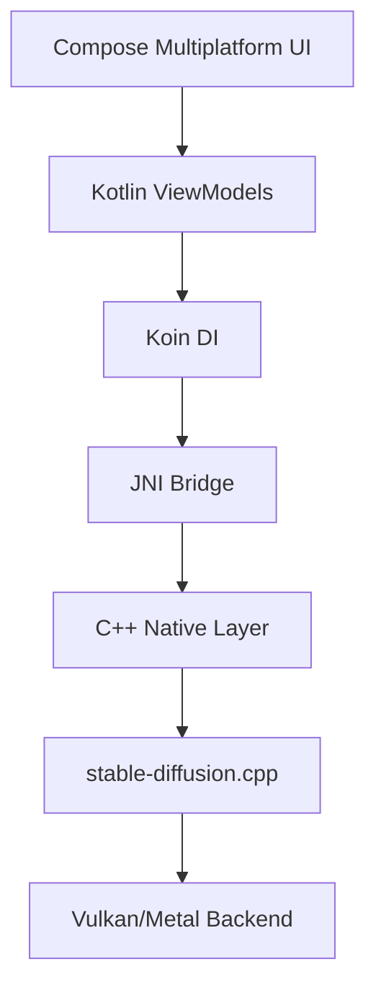

<div align="center">


# Mine StableDiffusion 🎨

**The most powerful multiplatform Stable Diffusion client**  
_Generate stunning AI art locally on Android & Desktop_

<p align="center">
  <a href="https://kotlinlang.org"></a>
  <a href="#"></a>
  <a href="https://github.com/Onion99/KMP-MineStableDiffusion/releases">
    
  </a>
  <a href="https://github.com/Onion99/KMP-MineStableDiffusion/stargazers">
    
  </a>
</p>

<p align="center">
  
  
  
  
</p>


</div>

---

## ✨ What is Mine StableDiffusion?

Mine StableDiffusion is a **native, offline-first AI art generation app** that brings the power of Stable Diffusion models to your fingertips. Built with modern Kotlin Multiplatform technology and powered by the blazing-fast [stable-diffusion.cpp](https://github.com/leejet/stable-diffusion.cpp) engine, it delivers desktop-class performance on both Android and Desktop platforms.

### 🎯 Why Choose This App?

- **🚀 Native Performance** - C++ backend with JNI bindings for maximum speed
- **🔒 Privacy First** - 100% offline, all processing happens on your device
- **🎨 Modern UI** - Beautiful Compose Multiplatform interface
- **📱 True Multiplatform** - Shared codebase for Android & Desktop
- **🔧 Model Flexibility** - Support for FLUX, SDXL, SD3, and many more
- **⚡ Hardware Accelerated** - Vulkan 1.2+ (Android/Linux/Windows) & Metal (macOS)

---

## 📸 Screenshots

<div align="center">

|                  🤖 Android-1                  |                Android-2                |                  Android-3                  |
|:----------------------------------------------:|:---------------------------------------:|:-------------------------------------------:|
|  |  |  | 


|                 💻 Desktop-1                  |                 💻 Desktop-2                  |
|:---------------------------------------------:|:---------------------------------------------:|
|  |  | 

</div>

---

## 🎲 Supported Models

Mine StableDiffusion supports a wide range of state-of-the-art generative models:

### 🔥 Popular Models
- ✅ **[FLUX.1-dev / FLUX.1-schnell](https://github.com/leejet/stable-diffusion.cpp/blob/master/docs/flux.md)** - Next-gen image generation
- ✅ **[FLUX.2-dev](https://github.com/leejet/stable-diffusion.cpp/blob/master/docs/flux.md)** - Latest FLUX iteration
- ✅ **[SDXL / SDXL-Turbo](https://huggingface.co/stabilityai/sdxl-turbo)** - High-quality 1024x1024 images
- ✅ **[SD3 / SD3.5](https://github.com/leejet/stable-diffusion.cpp/blob/master/docs/sd3.md)** - Stability AI's latest architecture
- ✅ **SD1.x / SD2.x** - Classic Stable Diffusion models
- ✅ **[SD-Turbo](https://huggingface.co/stabilityai/sd-turbo)** - Lightning-fast generation

### 🌈 Specialized Models
- 🎨 **[Chroma](https://github.com/leejet/stable-diffusion.cpp/blob/master/docs/chroma.md) / [Chroma1-Radiance](https://github.com/leejet/stable-diffusion.cpp/blob/master/docs/chroma_radiance.md)** - Vibrant color generation
- 🖼️ **[Z-Image](https://github.com/leejet/stable-diffusion.cpp/blob/master/docs/z_image.md)** - Advanced image synthesis
- 🧠 **[Qwen Image](https://github.com/leejet/stable-diffusion.cpp/blob/master/docs/qwen_image.md)** - Alibaba's multimodal model
- 👁️ **[Ovis-Image](https://github.com/leejet/stable-diffusion.cpp/blob/master/docs/ovis_image.md)** - Vision-language model

> [!TIP]
> For model-specific documentation, check the [docs](./docs) folder

---

## 🌟 Key Features

### Text-to-Image Generation
Generate stunning images from text descriptions with various models

```
Input: "A serene mountain landscape at sunset, digital art"
Output: High-quality AI-generated image
```

### Custom Model Support
- Load your own fine-tuned models
- Support for GGUF format models
- VAE and LoRA customization
- Flexible model switching

### Advanced Controls
- Customizable generation parameters (steps, CFG scale, sampler)
- Multiple aspect ratios
- Seed control for reproducible results
- Batch generation support

---

## 📱 Platform Support

| Platform | Status | Requirements |
|----------|--------|--------------|
| 🤖 Android | ✅ Supported | Android 11+ (API 30+) |
| 🪟 Windows | ✅ Supported | Windows 10+ with Vulkan 1.2 |
| 🐧 Linux | ✅ Supported | Vulkan 1.2+ drivers |
| 🍎 macOS | ✅ Supported | Metal support required |
| 📱 iOS | ⏳ Planned | Coming soon |

> [!NOTE]
> iOS support is under development and will be available in future releases

---

## 🏗️ Architecture & Tech Stack

### Core Technologies



### Technology Stack
- **Language**: Kotlin Multiplatform
- **UI Framework**: Compose Multiplatform
- **Dependency Injection**: Koin v4.1.1
- **Navigation**: Jetpack Navigation Compose
- **Networking**: Ktor 3.2.3 + Sandwich 2.1.2
- **Image Loading**: Coil3 v3.3.0
- **Concurrency**: Kotlin Coroutines
- **Native Engine**: [stable-diffusion.cpp](https://github.com/leejet/stable-diffusion.cpp)
- **LLM Support**: [llama.cpp](https://github.com/ggerganov/llama.cpp)

---

## 🚀 Getting Started

### Prerequisites
- **Android**: Android 11+ device with Vulkan 1.2 support
- **Desktop**: Windows/Linux/macOS with compatible graphics drivers
- **Development**: Android Studio Ladybug or later / IntelliJ IDEA

### Installation

#### Option 1: Download Pre-built Release
1. Visit [Releases](https://github.com/Onion99/KMP-MineStableDiffusion/releases)
2. Download the appropriate package for your platform
3. Install and launch

#### Option 2: Build from Source
```bash
# Clone the repository
git clone https://github.com/Onion99/KMP-MineStableDiffusion.git
cd KMP-MineStableDiffusion

# Build for Desktop
./gradlew :composeApp:run

# Build for Android
./gradlew :composeApp:assembleDebug
```

### First Run
1. Launch the app
2. Load your Stable Diffusion model (GGUF format)
3. Enter your text prompt
4. Click generate and watch the magic happen! ✨

---

## 📚 Documentation


- 📝 [Changelog](./CHANGELOG.md) - Version history

---

## 🤝 Contributing

Contributions are welcome! Whether it's:
- 🐛 Bug reports
- 💡 Feature requests
- 📝 Documentation improvements
- 🔧 Code contributions

Please read our [Contributing Guidelines](./CONTRIBUTING.md) before submitting PRs.

---

## 📄 License

This project is licensed under the **Apache License 2.0** - see the [LICENSE](LICENSE) file for details.

---

## 🙏 Acknowledgments

Special thanks to:
- [leejet/stable-diffusion.cpp](https://github.com/leejet/stable-diffusion.cpp) - Awesome C++ SD implementation
- [ggerganov/llama.cpp](https://github.com/ggerganov/llama.cpp) - LLM inference framework
- [JetBrains Compose Multiplatform](https://www.jetbrains.com/lp/compose-multiplatform/) - UI framework
- The entire Stable Diffusion community 💜

---

## 💙 Support This Project

If you find this project useful:
- ⭐ Star this repository
- 🐛 Report bugs and suggest features
- 🔀 Fork and contribute
- 📢 Share with others

---

## 📬 Contact

- **Issues**: [GitHub Issues](https://github.com/Onion99/KMP-MineStableDiffusion/issues)
- **Discussions**: [GitHub Discussions](https://github.com/Onion99/KMP-MineStableDiffusion/discussions)

---


