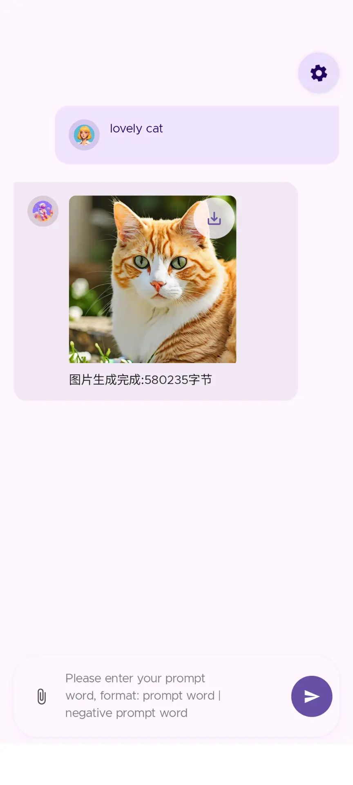
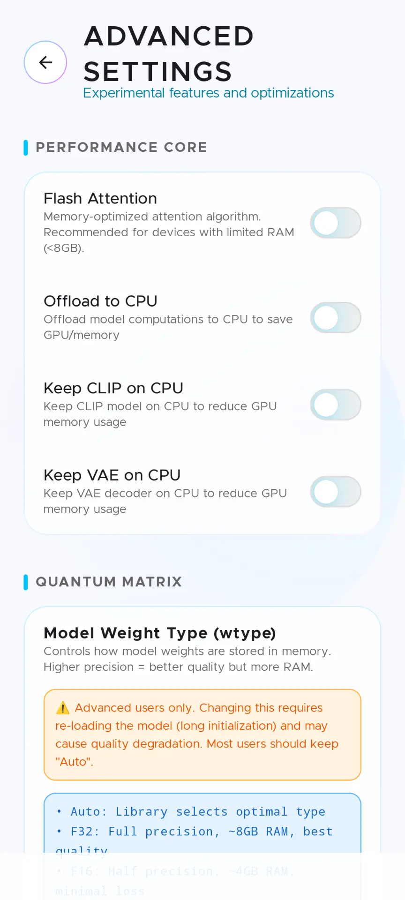
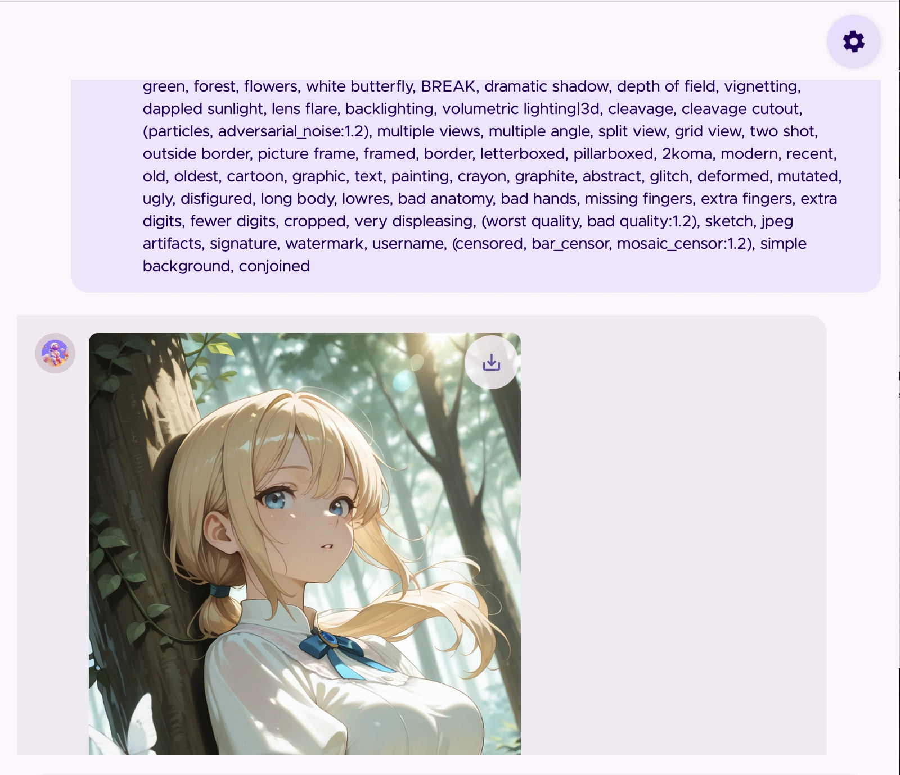
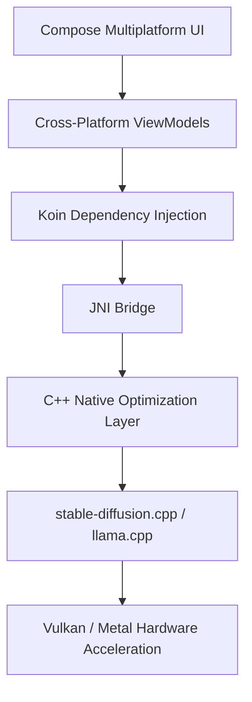

<div align="center">


# Mine StableDiffusion 🎨

**The kotlin multiplatform Stable Diffusion client**  
_Generate stunning AI art locally on Your devices_

<p align="center">
  <a href="https://kotlinlang.org"></a>
  <a href="#"></a>
  <a href="https://github.com/Onion99/KMP-MineStableDiffusion/releases">
    
  </a>
  <a href="https://github.com/Onion99/KMP-MineStableDiffusion/stargazers">
    
  </a>
</p>

<p align="center">
  
  
  
  
</p>


</div>

---

## ✨ What is Mine StableDiffusion?

Mine StableDiffusion is a **native, offline-first AI art generation studio** resting right in your pocket or on your desk. Built entirely on modern Kotlin Multiplatform and powered by the blazing-fast [stable-diffusion.cpp](https://github.com/leejet/stable-diffusion.cpp) engine, it delivers desktop-class inference capabilities across Android, iOS, and Desktop platforms.

### 🎯 The Edge

- 🚀 **Native Performance** — Pure C++ backend combined with JNI bindings ensures maximum hardware utilization.
- 🔒 **100% Privacy** — Everything runs offline. No cloud, no subscriptions, no data harvesting.
- 📱 **True Multiplatform** — A unified, beautiful Compose Multiplatform UX natively adapted for Mobile & Desktop.
- � **Pro-Level Controls** — Granular control over VRAM (Flash Attention, CPU Offloading, Direct Convolution).
- 🧩 **Endless Expansion** — Out-of-the-box support for external `.safetensors` LoRAs, advanced Samplers, and metadata injection.

---

## 📸 See It In Action

### 📱 **Mobile Experience** (Android / iOS)
| App Settings | Generating View | Output Gallery |
|:---:|:---:|:---:|
|  |  |  |

### 💻 **Desktop Experience** (Windows / macOS / Linux)
| Fluid UI | Creative Workflows | macOS Native |
|:---:|:---:|:---:|
|  |  |  |

---

## 🔥 Highlighted Features

### 🖼️ Batch / Text-to-Image Generation
Never generate just one idea again. **Batch Generation** synchronously crafts up to 10 iterations of your prompt with beautiful inline progress tracking right in your chat flow.

### 🎭 Infinite Styles via LoRA
Drag-and-drop support for `.safetensors` LoRA extensions. Mix multiple LoRAs simultaneously with precision weight sliders built right into the UI.

### 🎛️ Transparent Sampling & Prompting
Master the machine. Switch Sampler algorithms on the fly (Euler a, DPM++ 2M, LCM, TCD, etc.) to discover exactly how they mutate your art.

### 🏷️ Self-Documenting Art
Exported PNGs automatically embed all generation parameters (Prompt, Seed, Model, Sampler, CFG, LoRAs). Just drop the image back into any SD tool, and your exact setup is retrieved.

---

## 🎲 Model Support & Tiers

We cover bleeding-edge architectures. Ensure the models you pick fit within your device's VRAM limits:

> [!TIP]
> **Start Small**: We highly recommend testing the waters with **SD-Turbo** or **SD 1.5** models to gauge your device's capabilities before moving to demanding architectures like FLUX.

### ⚖️ Entry & Speed (Fastest, Minimal VRAM)
_Ideal for older phones or integrated graphics. High speed, low memory usage._
- ✅ **[SD-Turbo](https://huggingface.co/stabilityai/sd-turbo)** - Extremely fast 1-step generation
- ✅ **[SD1.x / SD2.x/Illustrious](https://civitai.com/models)**
- ✅ **[SDXL-Turbo](https://huggingface.co/stabilityai/sdxl-turbo)** - Fast high 512x512
    - Test:[Model](https://huggingface.co/stabilityai/sdxl-turbo/blob/main/sd_xl_turbo_1.0_fp16.safetensors)
    -  
- ✅ **🖼️ [Z-Image](https://github.com/leejet/stable-diffusion.cpp/blob/master/docs/z_image.md)** - Advanced image synthesis
    - Test:[Model](https://huggingface.co/leejet/Z-Image-Turbo-GGUF/blob/main/z_image_turbo-Q2_K.gguf)+[VAE](https://huggingface.co/black-forest-labs/FLUX.1-schnell/blob/main/ae.safetensors)+[LLM](https://huggingface.co/unsloth/Qwen3-4B-Instruct-2507-GGUF/blob/main/Qwen3-4B-Instruct-2507-Q2_K_L.gguf)
    -  

### 💎 Professional Quality (High Requirements)
_Best for high-detail 1024x1024+ generation. Requires more VRAM and time._
- ✅ **[SDXL](https://huggingface.co/stabilityai/sdxl-turbo)** - Standard high-quality base model
- ✅ **[SD3 / SD3.5](https://github.com/leejet/stable-diffusion.cpp/blob/master/docs/sd3.md)** - Stability AI's latest high-fidelity architecture
- ✅ **👁️ [Ovis-Image](https://github.com/leejet/stable-diffusion.cpp/blob/master/docs/ovis_image.md)** - Vision-language model
- ✅ **🎨 [Chroma](https://github.com/leejet/stable-diffusion.cpp/blob/master/docs/chroma.md) / [Chroma1-Radiance](https://github.com/leejet/stable-diffusion.cpp/blob/master/docs/chroma_radiance.md)** - Vibrant color generation
    - Chroma-Test:[Model](https://huggingface.co/silveroxides/Chroma-GGUF)+[VAE](https://huggingface.co/black-forest-labs/FLUX.1-dev/blob/main/ae.safetensors)+[T5XXL](https://huggingface.co/comfyanonymous/flux_text_encoders/blob/main/t5xxl_fp16.safetensors)
    - 
- ✅ **[FLUX.1-schnell / dev](https://github.com/leejet/stable-diffusion.cpp/blob/master/docs/flux.md)** - Next-gen image quality
- ✅ **[FLUX.2-dev](https://github.com/leejet/stable-diffusion.cpp/blob/master/docs/flux.md)** - Latest and most capable iteration

---

## 🛠 Advanced Controls Deep Dive

For power users, our settings menu opens up the entire `stable-diffusion.cpp` engine.

| Tuning Parameter | What it does | Pro Tip |
|------------------|--------------|---------|
| **Quantization (wtype)** | Formats weights to limit RAM footprint (F16, Q8_0, Q4_K). | _Leave on `Auto` unless explicitly tuning for low VRAM targets._ |
| **Flash Attention** | Memory-optimized attention tracking logic. | _Enable immediately on devices with `< 8GB RAM` for huge memory savings._ |
| **CPU Offloading** | Manually unloads layers (like CLIP or VAE) out of VRAM. | _If you hit `Out of Memory` decoding the final image, enable `Keep VAE on CPU`._ |
| **Memory Mapping (MMAP)** | Maps weights directly from storage rather than bulk loading RAM. | _Enabled on Android by default. Disable on Desktop if you have slow HDDs._ |

<br>
<div align="center">
  
</div>
<br>

---

## � Platform Compatibility

| OS | Status | Hardware Requirement |
|:---|:---:|:---|
| 🤖 **Android** | ✅ Stable | Android 11+ (API 30+) running **Vulkan 1.2+** |
| 🪟 **Windows** | ✅ Stable | Windows 10+ running **Vulkan 1.2+** |
| 🐧 **Linux** | ✅ Stable | Standard modern **Vulkan 1.2+** drivers |
| 🍎 **macOS** | ✅ Stable |  Silicon or Intel with **Metal** Support |
| 📱 **iOS** | ✅ Beta   | A13 Bionic or newer, **Metal** Support |

---

## �️ Architecture

Under the hood, Mine StableDiffusion relies on zero compromises:


```mermaid
graph TB
    A[Compose Multiplatform UI] --> B[Cross-Platform ViewModels]
    B --> C[Koin Dependency Injection]
    C --> D[JNI Bridge]
    D --> E[C++ Native Optimization Layer]
    E --> F[stable-diffusion.cpp / llama.cpp]
    F --> G[Vulkan / Metal Hardware Acceleration]
```

---

## 🚀 Get Started Now

### Option 1: Quick Install (Recommended)
1. Head over to our [Releases Page](https://github.com/Onion99/KMP-MineStableDiffusion/releases).
2. Download the package crafted for your OS (`.apk`, `.dmg`, `.exe`).
3. Simply launch it, point it to a model (`.gguf` or `.safetensors`), and begin typing your prompt!

### Option 2: Build From Source
Got Android Studio or IntelliJ IDEA?
```bash
# Clone the repository
git clone https://github.com/Onion99/KMP-MineStableDiffusion.git
cd KMP-MineStableDiffusion

# Build for Desktop
./gradlew :composeApp:run

# Build for Android
./gradlew :composeApp:assembleDebug
```

---

## 📚 Resources & Community

- 📑 **[Read the Changelog](./CHANGELOG.md)** — Track what's new.
- 🎨 **[Community Showcase](https://github.com/Onion99/KMP-MineStableDiffusion/issues/13)** — Show off your amazing generations or fetch prompts from others!

### ❤️ Acknowledgements
We stand on the shoulders of giants:
- The masterful [leejet/stable-diffusion.cpp](https://github.com/leejet/stable-diffusion.cpp)
- The trailblazing [ggerganov/llama.cpp](https://github.com/ggerganov/llama.cpp)
- The incredible [JetBrains Compose Multiplatform](https://www.jetbrains.com/lp/compose-multiplatform/) team.

---

<p align="center">
<b>Enjoying the project? Share some love by giving it a ⭐ and spreading the word!</b><br>
Licensed under the <b>GPL 3.0</b> License
</p>
